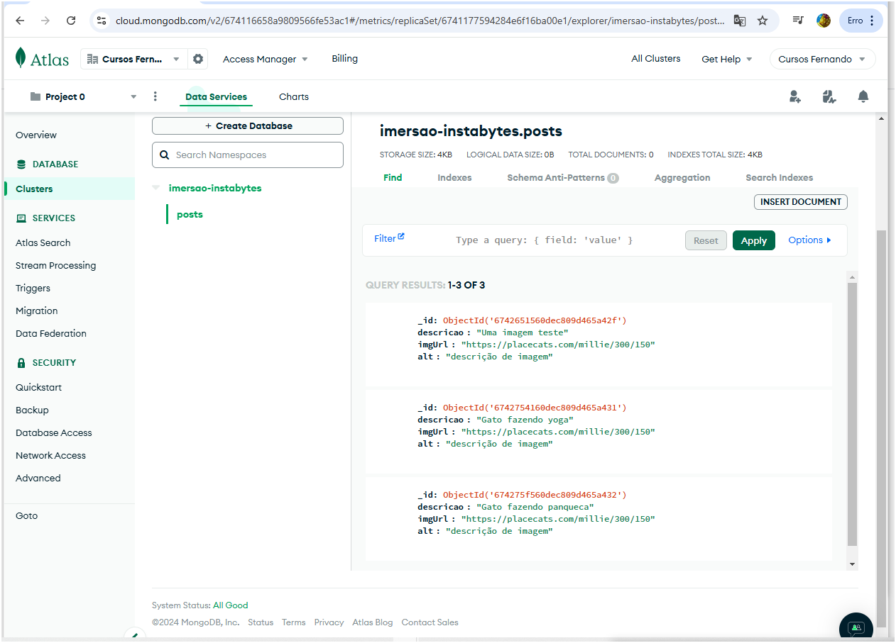
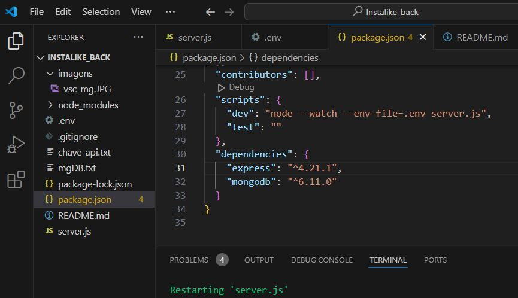
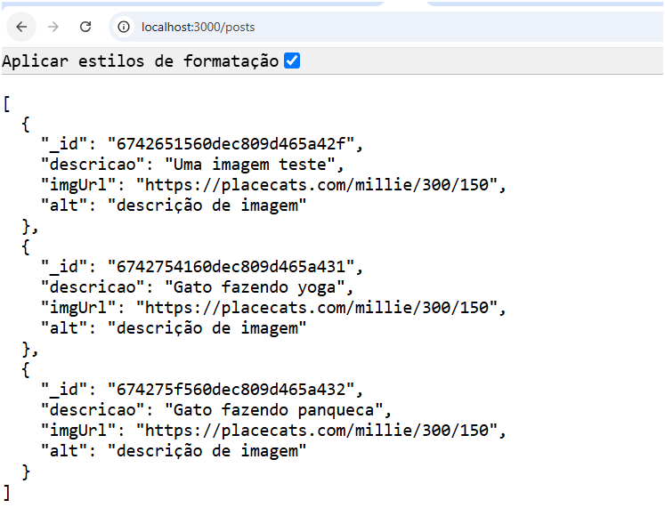
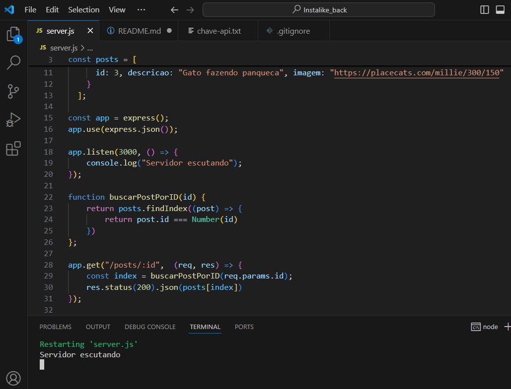
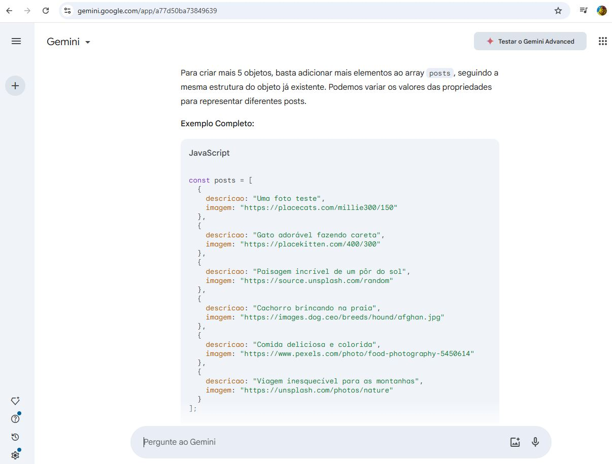
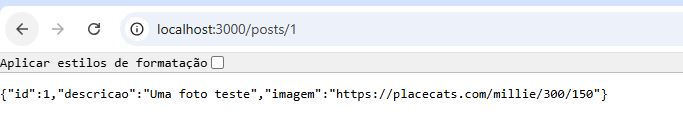
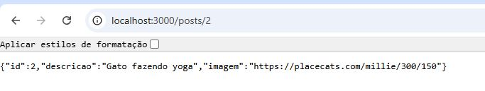
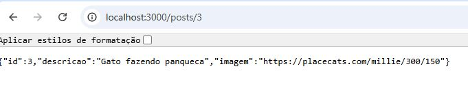
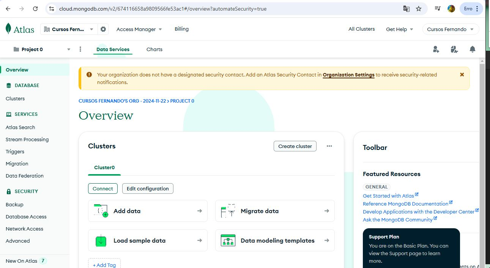

# iDevBackEnd
Projeto de Imersão Developer Back-end com NodeJS e Gemini patrocionado por Alura de 14 a 25 nov/2024.

# 3ª AULA - CONECTANDO SUA API AO MONGODB: ESTRUTURA, CONEXÃO E REFATORAÇÃO 

**Relatório e documentação;**

Nessa aula vamos substituir nossa antiga base de dados o "Array" por nosso BD nas Nuvens, incluir mais uma dependência que é o nosso banco de dados mongoDB, vamos no site do banco mongoDB Atlas criar e fazer um deploy de nossa database e subir nossas coleções de posts. Vamos pegar todas as nossas informações que estão na cloud e trazer para o nosso projeto. Vamos proteger dados sensíveis criando variáveis de ambiente e o arquivo raiz `.env`. Dentro do arquivo `package.json`, incrementamos o script "dev" dizendo para o node que tem um arquivo de variável de ambiente e seu nome é `.env`.

Pela necessidade e evolução de nosso projeto, foi criado um modelo de pastas e arquivos visando as três responsabilidades principais, que são sobre: a rota, o controlador (que possui funções de request e response), e o modelo que possui instruções de conexão ao banco de dados. Criamos para isso uma pasta raiz de nome `src` e, dentro dessa pasta, temos: a pasta `config` e seu arquivo `dbConfig.js`; a pasta `controllers` e seu arquivo `postController.js`; e, por último, a pasta `routes` com o seu arquivo `postsRoutes.js`.

Depois, alteramos o código fonte de `server.js`, distribuindo as instruções para cada pasta e arquivo correspondente ao que se trata suas respectivas responsabilidades. Exportamos e importamos funções de um lugar a outro para que essas partes possam se conectar e suas funções serem executadas com êxito.

**Informações adicionais;**

- Usamos o Gemini IA da google para consulta, complemento e ajuda.

- Aprendemos o que são as palavras chaves async e await dentro de uma função e porque em certos casos, uma vem seguida da outra ao ser declarada.

- Usamos comandos npm / yark.

- Por regras de boa prática o arquivo .gitignore foi alterado impedido que suba no gitHube via comandos no prompt git bash, arquivos como; node_modules, chave-api.txt, mgDB.txt e .env.

- Atualização do arquivo README.md - incrementação de imagens do processo, relatorios e documentação.
 

- Criado repositorio iDevBackEnd no GitHube e salvo repositório em branch aula_3

**Imagens do meu projeto neste estagio - aula 3;**

👆 &nbsp; <mark>Site MongoDBAtlas com coleções de posts criadas.</mark>

👆 &nbsp; <mark>VSCode arquivo {}package.json - Sript Dev e dependencias.</mark>

👆 &nbsp; <mark>localhost:3000/posts resposta do server conectado ao MongoDB nos trazendo as nossas coleções de posts</mark>

◙XXXXXXX

# 2ª AULA - CRIANDO E ESTRUTURANDO SUA PRIMEIRA API COM GET E BANCO DE DADOS MONGODB ATLAS NA NUVEM.

**Imagens do meu projeto neste estagio - aula 2;**

👆 &nbsp; <mark>Visual Studio Code - codando em node.js + NPM + Expreess + ES6.</mark>

👆 &nbsp; <mark>Uso do Gemini IA da Google como consulta, apoio e criação.</mark>

👆 &nbsp; <mark>Resposta do server id1 no Navegador.*</mark>

👆 &nbsp; <mark>Resposta do server id2 no Navegador.</mark>

👆 &nbsp; <mark>Resposta do server id3 no Navegador.</mark>

👆 &nbsp; <mark>Criação da conta do banco de dados MongoDB Atlas(nuvem).</mark>

**Relatório e documentaçao;**

[No arquivo server.js foi incrementado como uma base de dados uma variavel que recebe uma array de objetos; com id, descrição e imagens], [foi usado a IA Gemini do Google para consulta e criação de imagens e outros], [no código fonte server.js  alteramos info de Rota e incremntação de instancia de API no server], [criada e declarada uma function buscarPostID],[teste de nosso server, teste ok], [Criado conta para acesso ao banco MongoDB_Atlas hospedado na nuvem], [criado a pasta imagens e geradas algumas imagens do processo para arquivo e documentação posteriores], [criado arquivo mgDB.txt com informações sobre dados como username e password e path do banco de dados], [Por regras de boa prática o arquivo .gitignore foi alterado impedido que suba no gitHube via comandos no prompt git bash, arquivos como; node_modules, chave-api.txt e mgDB.txt], [Atualização do arquivo README.md - incrementação de imagens do processo, relatorios e documentação]. [criado repositorio iDevBackEnd no GitHube e salvo repositório em branch aula_2].
 

◙XXXXXXX

# 1ª AULA - DESVENDANDO APIS SERVIDORES 

**Relatório / Documentação;**

[Instalando Nodejs (LTS v.22.11.0) no Windows 10 64bits], [Instalando o Visual Studio Code no windows 10 64 bits], [Testando o Node.JS no terminal CMD do VSCode], [Criação da pasta do projeto "instaslike_back"], [ Instalando NPM e setando a linguagem JavaScript mais moderna ES6 juntamente e automaticamente criou a pasta de  package.json em nosso projeto], [Instalando as depencias como o express v"^4.21.1" via comandos de prompt via npm e junto e automatico a package-lock.json com 65 packages ou dependencias, instalado tbm a pasta node_modules dentro de nosso projeto], [criação do arquivo server.js como nosso servidor, nele  importamos o Express, incrementamos porta 3000 e funções de req request e res response e como respoosta send envia msg in http://localhost:3000/api e após executamos o server para testes e ok testes],[No site da Gemini google, gerando a nossa primeira chave api],[criação do arquivo chave-api.txt], [por boas práticas; criação do arquivo .gitignore para nos comandos do prompt do git bash não subir 2 condições; chave-api.txt e node_modules ], [Iserindo informações de relatório e documentação no arquivo README.md], [criado repositorio iDevBackEnd no GitHube e salvo repositório em branch aula_1]
 

◙XXXXXXX

- 👋 Hi, I’m @DevFernandoSeabra
- 👀 I’m interested in ...
- 🌱 I’m currently learning ...
- 💞️ I’m looking to collaborate on ...
- 📫 How to reach me ...
- 😄 Pronouns: ...
- ⚡ Fun fact: ...

<!---
DevFernandoSeabra/DevFernandoSeabra is a ✨ special ✨ repository because its `README.md` (this file) appears on your GitHub profile.
You can click the Preview link to take a look at your changes.
--->
