# iDevBackEnd

[](https://github.com/DevFernandoSeabra/iDevBackEnd/blob/main/LICENSE)

# Sobre o projeto

Projeto de Imersão Developer Back-end com NodeJS e Gemini patrocionado por Alura de 14 a 25 nov/2024.

A ideia é desenvolver o back-end de um site de coleções de postagens de imagens diversas, com foco em criação, leitura e atualização no que se refere a postagem da imagem e de sua descrição.

São 5 aulas de imersão e conhecimento, todas documentadas, testadas e publicadas aqui.

# 5ª AULA PARTE I - CONFIGURAÇÃO DE API E INTEGRAÇÃO COM GEMINI
<p style="text-align: justify;">
&nbsp; &nbsp;- Resolvi dividi em duas partes a aula 5, devido esta primeira parte afirmar que a nossa aplicação publicada aqui no guitHub esta completamente terminada. Como se trata de uma aplicação Back-End é só repassá-la à equipe de desenvolvimento de Front-End para dar continuidade.</p>

&nbsp; &nbsp;A segunda parte consiste em alocar nossa API no Google Cloud que é um serviço de hospedagem na nuvem do Google e que para subir é preciso criar e preparar todo o ambiente visando protocolos de proteção e segurança, instalação do pacote DOTENV, fazer a liberação do MongoDBAtlas fazendo Allow Access From Anywhere para o GCloud, subir em arquivo Git comandos do terminal shell e outras boas práticas.</p> Para acessar o repositório principal do projeto <span style="color: yellow;">Imersão Developer Back-end com NodeJS e Gemini patrocinado por Alura e alocado no Google Cloud</span>, clique [aqui](https://github.com/DevFernandoSeabra/iDevBackEndMain).</p>


**Relatório e documentação;**</p>
<p style="text-align: justify;">
&nbsp; &nbsp;Nessa aula iremos desenvolver o <b>metodo PUT (Atualizar) dos "Verbo HTTP"</b>, pois nós já criamos uma parte de uma lógica para usar nossa pasta uploads de nosso servidor local e renomear as imagens contidas nessa pasta com IDs idênticos ao do banco de dados na nossa nuvem mopngoDBAtlas e precisamos finalizar a lógica ou seja atualizar o mesmo registro de ID trocando a foto/imagem e/ou a descrição e/ou outras infos e mantendo a mesma identificação ID, e o grande diferencial é que usaremos o <b>Gemini a Inteligencia Artificial da Google </b>para inserir a descrição da foto/imagem para nós automaticamente. E pra finalizar instalar e configurar o <b>CORS - CROSS-ORIGIN RESOURECE SHARING </b>(Pesquisa Compartilhamento de Origem Cruzada) que depois explicaremos.</p>

**Informações adicionais;**</p>

- Configuramos o nosso servidor local para deixa-lo estático. Estamos dizendo para o Express: - oh Express tudo q estiver dentro dessa pasta ".../uploads" a gente vai abrir para ser acessado ou servido por quem chegar ou bater lá no endereço de nosso servidor http://localhost:3000/upload. Essa prática é chamada de **SERVIR ARQUIVOS ESTÁTICOS**.</p>

- Foi criada uma **new async function atualizarNovoPost** responsável por atualizar a imagem e a descrição e outras infos referentes ao um ID especifico e distinto, dentro do banco de dados na nossa nuvem mongoDBAtlas e dentro de nosso servidor/máquina local. E devido a lógica foi incrementada outras funções, métodos e modelos para fazer funcionar o **MVP (Minimum Viable Product)** que é um conceito fundamental em metodologias ágeis e no desenvolvimento de produtos. Seu objetivo principal é criar a versão mais simples e funcional de um produto que ainda possa ser usada pelos usuários para testar e validar hipóteses. O MVP foca nas funcionalidades essenciais necessárias para resolver um problema real de maneira mínima, permitindo que você colecione feedback e aprenda rapidamente com o mercado.</p>

- Gerado a **GEMINI_API_KEY, chave de segurança do Gemini IA da Google** que com ela libera o acesso e permite criar instruções ao Gemini e coletar as suas respostas em nossa API, tudo via códigos.

- Criada a **new async function gerarDescricaoComGemini** função responsavél por consultar o Gemini e solicitar a ele que gere para nós uma descrição em portugês do Brasil para a imagem que nosso cliente em nossa API apontar.

- instalado **em nossa API mais uma dependencia** a do Google Gemini.

- Continuamos a usar a ferramenta **POSTMAN** para desktop ambiente Windows 64 bits, **para testar; o envio, o recebimento e a atualização de nossos posts** tanto no banco de dados lá na nossa nuvem mongoDBATLAS como no nosso servidor/máquina local</p>

- Instalamos e configuramos o **CORS - CROSS-ORIGIN RESOURECE SHARING**. é um mecanismo de segurança implementado nos navegadores da web para permitir ou restringir o acesso a recursos hospedados em domínios diferentes daquele que originou a solicitação. Isso é necessário devido às políticas de mesma origem (Same-Origin Policy) que existem nos navegadores, que são desenhadas para evitar que scripts maliciosos em uma página web acessem recursos de outro domínio sem permissão. **1. Política de Mesma Origem (Same-Origin Policy)**
A Política de Mesma Origem é uma medida de segurança que impede que um site acesse recursos (como dados ou APIs) de outro site sem permissão. A "origem" é definida pelo esquema (como HTTP ou HTTPS), domínio e a porta da URL. A política é uma maneira de garantir que scripts de um site não possam acessar dados sensíveis de outro site sem o consentimento do servidor de destino.</p>
Por exemplo:
- Origem 1: https://meusite.com
- Origem 2: https://outrosite.com</p>De acordo com a política de mesma origem, se uma página de meusite.com tenta fazer uma requisição para outrosite.com, isso seria bloqueado pelo navegador, a menos que o outrosite.com permita explicitamente, o que é feito por meio do CORS. **2. O que é CORS?
CORS (Cross-Origin Resource Sharing)** é um mecanismo que permite que os servidores e navegadores definam regras para permitir ou negar o compartilhamento de recursos entre diferentes origens. Quando uma página de um site tenta acessar recursos de um servidor de outro domínio, o navegador faz uma solicitação HTTP preflight (pré-verificação), que é uma requisição HTTP OPTIONS, antes da requisição real ser feita. O servidor, então, responde com os cabeçalhos apropriados para indicar se o navegador pode ou não prosseguir com a solicitação. Para mais informações sobre CORS consulte: 
- [W3C CORS Specification](https://www.w3.org/TR/cors/)
- [MDN Web Docs - CORS](https://developer.mozilla.org/en-US/docs/Web/HTTP/CORS)</p>

- Usamos comandos **npm / yark**.</p>

- Atualização do arquivo README.md - incrementação de imagens do processo, relatorios e documentação.</p> 

- Criado repositorio iDevBackEnd no **GitHube** e salvo repositório em branch aula_5PI
</p>


## Imagens do meu projeto neste estagio - aula 5 Parte I

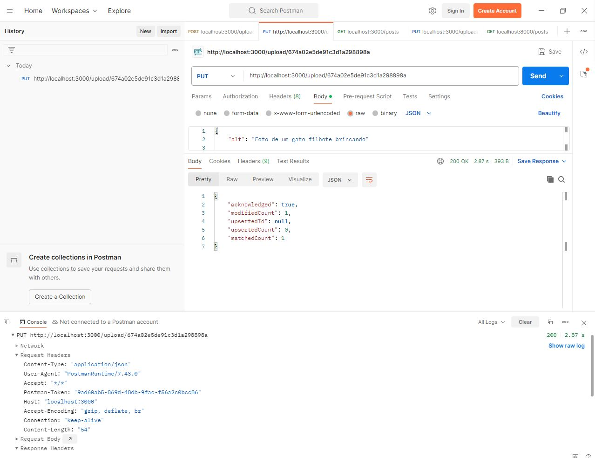</p>
<p>👆 &nbsp; <mark>Teste do módulo Put utilizando a ferramenta Postman endereço http://localhost:3000/674a02e5de91c3d1a298898a.</mark></p>

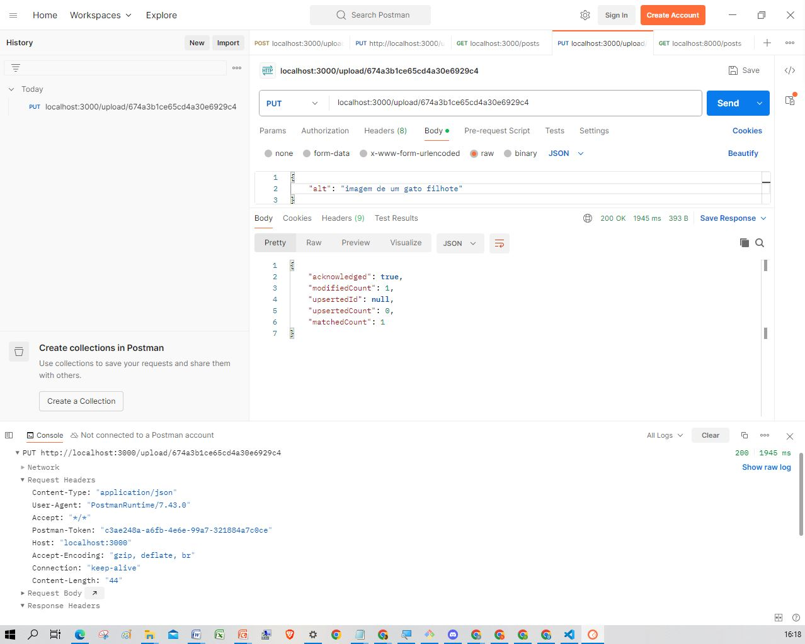</p>
<p>👆 &nbsp; <mark>Outro teste do módulo Put utilizando a ferramenta Postman endereço http://localhost:3000/674a3b1ce65cd4a30e6929c4.</mark></p>


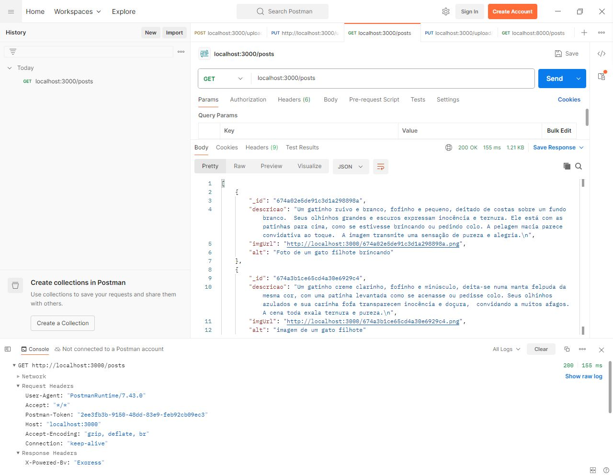</p>
<p>👆 &nbsp; <mark>Teste do módulo GET utilizando a ferramenta Postman endereço http://localhost:3000/posts. Perceba que aqui vieram as descrição geradas pelo o Gemini e atualizadas no banco de dados na nuvem monogoDBAtlas, das duas iamgems cada a qual com seu ID.</mark></p>

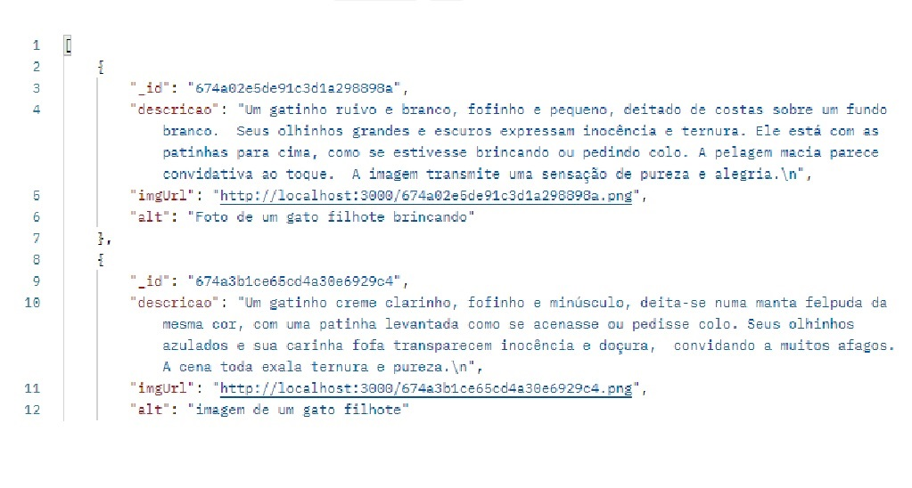</p>
<p>👆 &nbsp; <mark>Descrição gerada pelo Gemini.</mark></p>


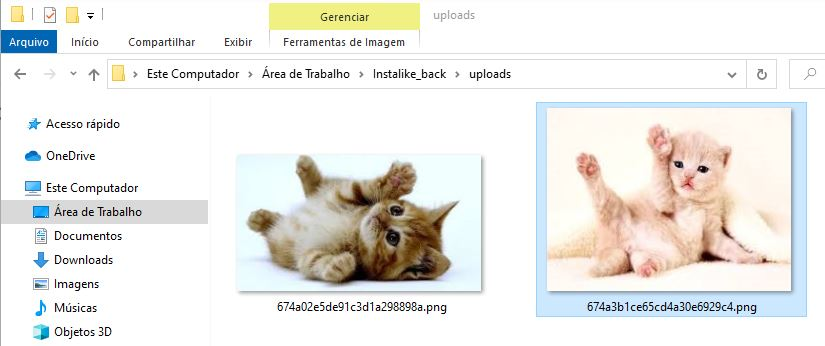</p>
<p>👆 &nbsp; <mark>As duas imagens dentro de nosso servidor/máquina na pasta uploads http://localhost:3000/uploads.</mark></p>

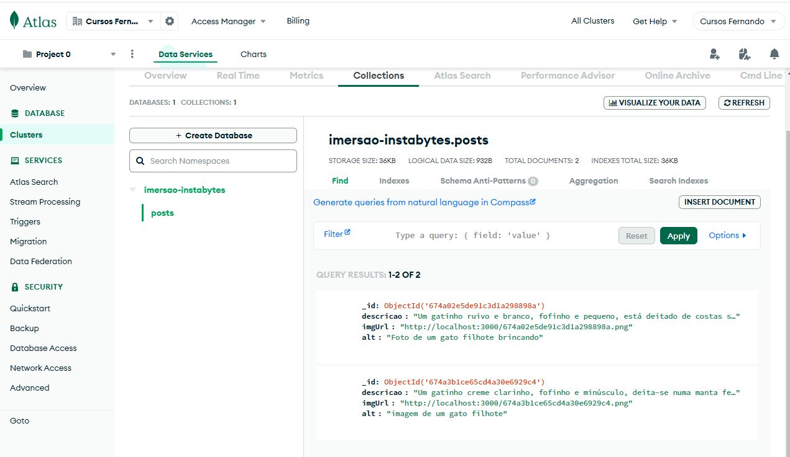</p>
<p>👆 &nbsp; <mark>Os registros de dentro de nosso banco de dados na nuvem MongoDBAtlas.</mark></p>

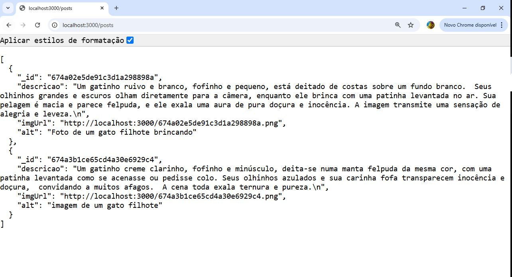</p>
<p>👆 &nbsp; <mark>Os registros no navegador com a descrição pelo Gemini e outras infos vindas do banco de dados na nuvem.</mark></p>

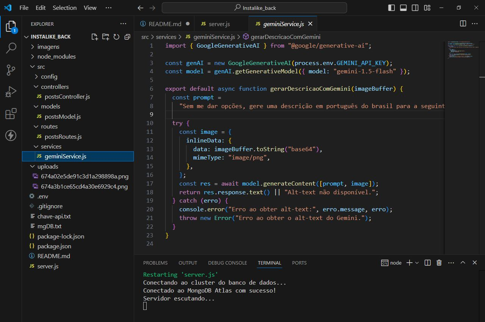</p>
<p>👆 &nbsp; <mark>Código do geminiServices.js no Visual Studio Code.</mark></p>

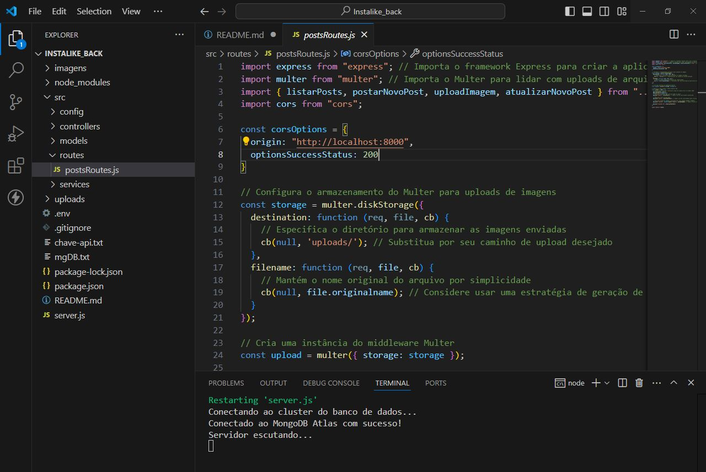</p>
<p>👆 &nbsp; <mark>Código do CORS no Visual Studio Code.</mark></p>


# 4ª AULA - IMPLEMENTANDO ARMAZENAMENTO E UPLOAD DE IMAGENS

**Relatório e documentação;**</p>
<p style="text-align: justify;">
Na aula passada aprendemos a pegar informações ou dados do nosso banco de dados na nossa nuvem "cloud" o mongoDB Atlas. Nessa aula iremos aprender a enviar dados de nossa API para o banco de dados - "vamos enviar posts" ou requisições .json como preferir. Aprendenmos a lidar com os 4 principais verbos HTTPs, são eles; POST (Criar), GET (Ler), PUT ou PATCH(Atualizar), DELETE (Deletar). Desenvolvemos algumas funções e métodos visando as 3 responsabilidades principais, que são sobre: a rota, o controlador (que possui funções de request e response), e o modelo que possui instruções de conexão ao banco de dados.
</p>

**Informações adicionais;**</p>

- Instalamos e Testamos nossa **API RESTful** com a ferramenta **THUNDER CLIENT** de modo a enviar requisições HTTP (GET, POST, PUT, DELETE, PATCH, etc.) diretamente do VS Code para testar APIs. E também o fizemos com outra ferramenta a **POSTMAN** para desktop ambiente Windows 64 bits. Construimos requisições tipo .Json com cabeçalhos personalizados, parâmetros de consulta, corpo de requisição personalizado e autenticação utlizando as ferramentas com auxilio e dentro dos respectivos recursos fornecidos do Thunder Client ou do Postman </p>

- importamos e trabalhamos com **o módulo fs do Node.js** que te permite interagir com o sistema de arquivos, oferecendo operações síncronas e assíncronas para ler, escrever, modificar e excluir arquivos e diretórios. A versão assíncrona é preferida para evitar o bloqueio do evento principal, garantindo melhor desempenho. O módulo fs faz com que nossa API consiga interagir com os sistemas de arquivos do nosso computador/servidor local.</p>

- instalamos mais uma dependência: o **Multer** que é um **middleware para o Node.js** usado para manipulação de uploads de arquivos em aplicativos web, principalmente com o framework Express. Ele facilita o processo de receber e armazenar arquivos enviados por meio de formulários HTML ou APIs.</p>
 
- Manipulamos arquivos do tipo **multipart/form-data**. O Multer permite que você trate arquivos enviados com o tipo de conteúdo multipart/form-data, o formato mais comum usado para upload de arquivos via formulários HTML.</p>

- Criamos uma nova pasta na raiz de nosso projeto chamada "uploads" para receber todas as nossas imagens fisícas, com isso a nossa maquina local será um servidor local.</p>

- Aprendemos e trabalhamos com  **template strings** (ou template literals) no JavaScript são uma forma moderna e mais poderosa de trabalhar com strings. Elas foram introduzidas no ECMAScript 6 (ES6) e oferecem várias melhorias em relação às strings tradicionais, como interpolação de variáveis e multi-linhas, entre outras funcionalidades.</p>
Sintaxe das Template Strings:</p>
Template strings são definidas com crase (``) em vez de aspas simples (') ou duplas (").</p>
Exemplo de aplicação código em javaScript:

```javascript
let nome = 'João';
let idade = 25;

// Exemplo básico de template string:
let saudacao = `Olá, meu nome é ${nome} e eu tenho ${idade} anos.`;
console.log(saudacao);  // Saída: "Olá, meu nome é João e eu tenho 25 anos."
```
- No nosso caso, usamos a template strings para juntar dois valores distintos, uma string + uma variável e e seu resultado gera uma nova string que será inserida em uma variavel.</p>
Resumindo: "String Interpolation" (Interpolação de String) é o termo técnico usado para descrever essa prática.</p>
Ao invés de concatenar com o operador +, você insere expressões diretamente dentro da string usando ${}.</p>
Exemplo de código em javaScript:</p>

```javascript
const imagemAtualizada = `uploads/${postcriado.insertedId}.png`
``` 
</p>

- Usamos **Placeholders** em Objetos e Arrays ao trabalhar com dados dinâmicos, onde a estrutura dos dados é definida, mas os valores podem ser preenchidos posteriormente. Que é uma maneira poderosa de tornar seu código mais flexível e dinâmico, seja para manipulação de strings, objetos ou em templates HTML.

- Usamos o **Gemini** IA da google para consulta, complemento e ajuda.</p>

- Usamos comandos **npm / yark**.</p>

- Atualização do arquivo README.md - incrementação de imagens do processo, relatorios e documentação.</p> 

- Criado repositorio iDevBackEnd no **GitHube** e salvo repositório em branch aula_4
</p>

## Imagens do meu projeto neste estagio - aula 4;

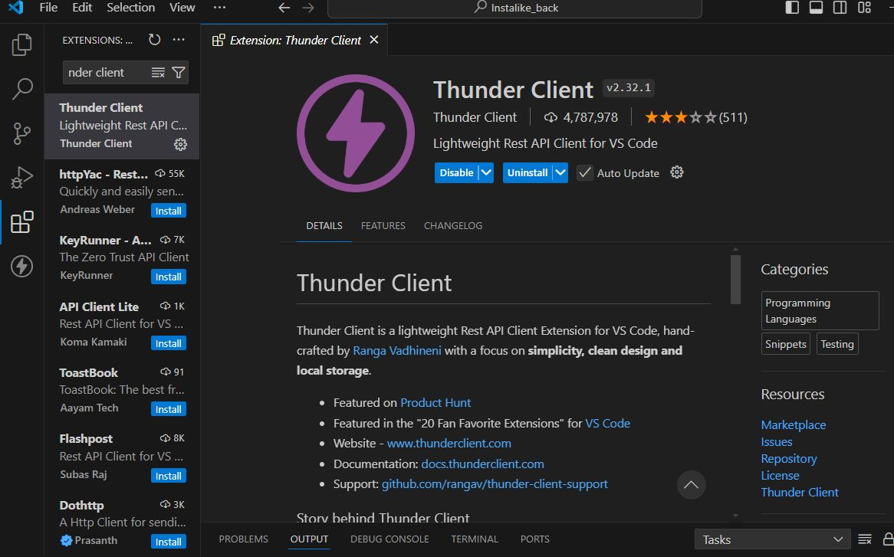</p>
<p>👆 &nbsp; <mark>Instalação do Thunder Client no Visual Studio Code.</mark></p>

</p>
<p>👆 &nbsp; <mark>Site do Postman preparando para o baixar.</mark></p>

</p>
<p>👆 &nbsp; <mark>+ uma dependencia instalada no VSCode o "Multer".</mark></p>

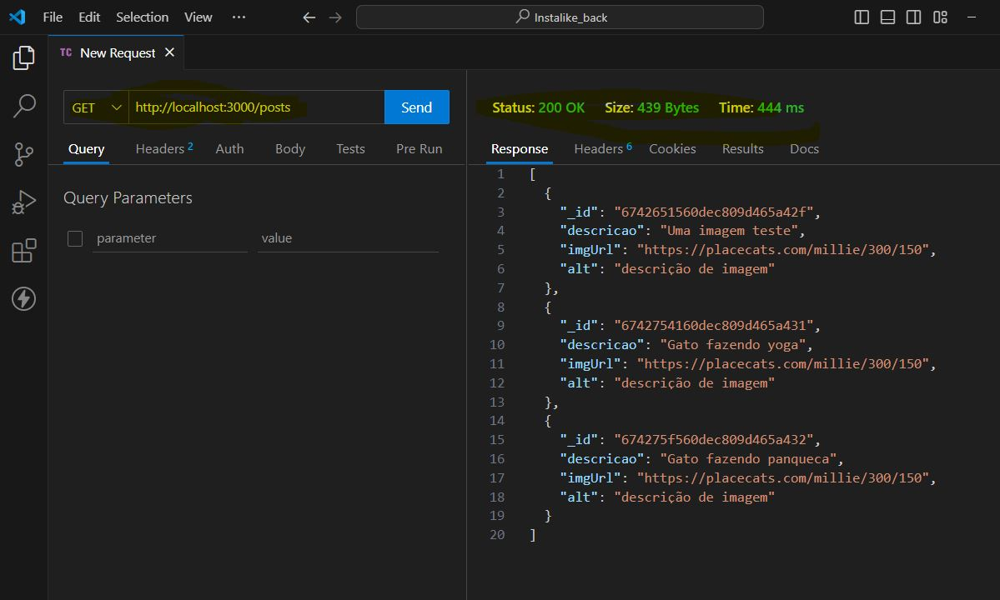</p>
<p>👆 &nbsp; <mark>Teste de nossa API RESTful módulo GET com a ferramenta de testes  Thunder Client usando url http://localhost:3000/posts.</mark></p>

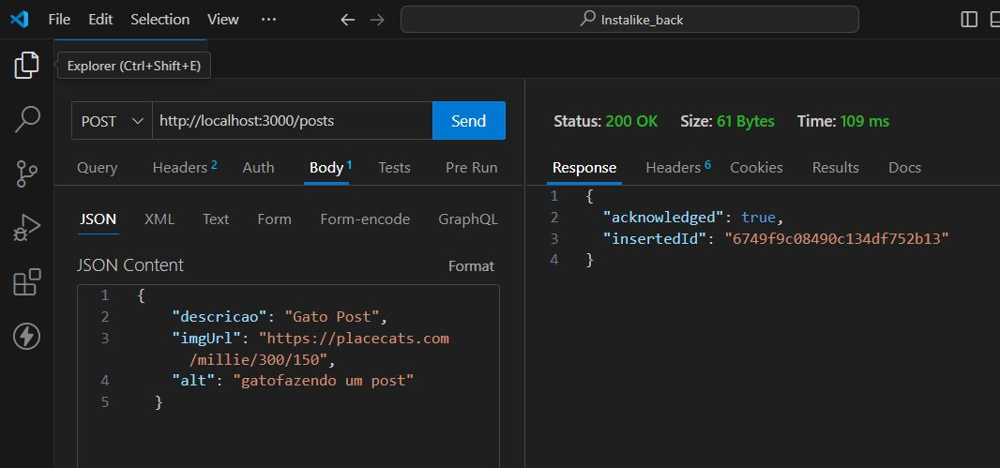</p>
<p>👆 &nbsp; <mark>Outro teste de nossa API RESTful módulo POST com a ferramenta de testes  Thunder Client usando url http://localhost:3000/posts.</mark></p>

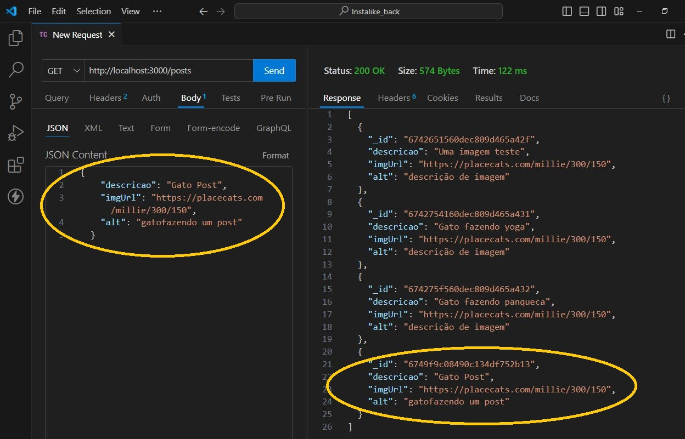</p>
<p>👆 &nbsp; <mark>Com o Thunder Client fizemos um novo GET para comprovar que o POST que enviamos anteriormente vide imagem acima, foi devidamente enviado e registrado pelo banco de dados na nuvem o mongoDBAtlas.</mark></p>

</p>
<p>👆 &nbsp; <mark>Testamos nossa API RESTful com a ferramenta Postman no módulo POST, mas agora gerando PlaceHolders de imagens do tipo .png e a utilizar também a nossa pasta de Uploads como servidor local e usando também a url especifica http://localhost:3000/uploads. Aqui manipulamos arquivos do tipo multipart/form-data</mark></p>


</p>
<p>👆 &nbsp; <mark>Complemento da imagem de cima - Site do banco de dados na nuvem mongoDBAtlas indicando que a imagem foi registrado com sucesso o seu insert.</mark></p>

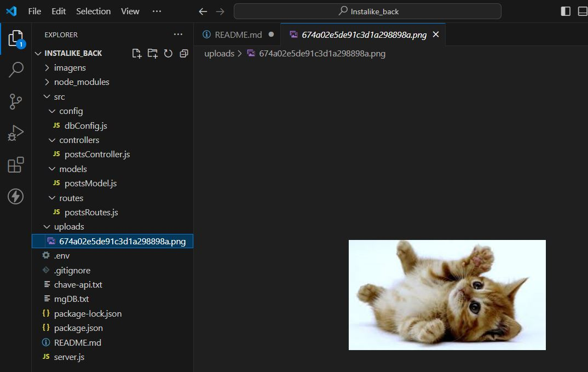</p>
<p>👆 &nbsp; <mark>Complemento da imagem de cima - Imagem cat1.png dentro do Visual Studio Code indicando nos que foi salva com sucesso na pasta de uploads dentro de nossa raiz do projeto e de nosso servidor local - nossa maquina.</mark></p>

</p>
<p>👆 &nbsp; <mark>Complemento da imagem de cima - imagem do explorer do windows, exibindo o conteudo da pasta uploads com a imagem salva cat1.png, observe que o Multer nos ajudou a renonear seu ID e deixa-lo comativel com o ID do mongoDBAtlas.</mark></p>


◙XXXXXXX

# 3ª AULA - CONECTANDO SUA API AO MONGODB: ESTRUTURA, CONEXÃO E REFATORAÇÃO 

**Relatório e documentação;**</p>
<p style="text-align: justify;">
Nessa aula vamos substituir nossa antiga base de dados o "Array" por nosso BD nas Nuvens, incluir mais uma dependência que é o nosso banco de dados mongoDB Atlas, vamos no site do banco mongoDB Atlas criar e fazer um deploy de nossa database e subir nossas coleções de posts. Vamos pegar todas as nossas informações que estão na cloud e trazer para o nosso projeto. Vamos proteger dados sensíveis criando variáveis de ambiente e o arquivo raiz `.env`. Dentro do arquivo `package.json`, incrementamos o script "dev" dizendo para o node que tem um arquivo de variável de ambiente e seu nome é `.env`.
</p>

<p style="text-align: justify;">
Pela necessidade e evolução de nosso projeto, foi criado um modelo de pastas e arquivos visando as três responsabilidades principais, que são sobre: a rota, o controlador (que possui funções de request e response), e o modelo que possui instruções de conexão ao banco de dados. Criamos para isso uma pasta raiz de nome `src` e, dentro dessa pasta, temos: a pasta `config` e seu arquivo `dbConfig.js`; a pasta `controllers` e seu arquivo `postController.js`; e, por último, a pasta `routes` com o seu arquivo `postsRoutes.js`.
</p>

<p style="text-align: justify;">
Depois, alteramos o código fonte de `server.js`, distribuindo as instruções para cada pasta e arquivo correspondente ao que se trata suas respectivas responsabilidades. Exportamos e importamos funções de um lugar a outro para que essas partes possam se conectar e suas funções serem executadas com êxito.
</p>

**Informações adicionais;**</p>
- Criamos mais uma dependencia **mongoDBAtlas** em nossa API. Configuramos o site e fizemos 3 inserts documents um vedadeiro deploy com dados de nossa coleção de posts.

- Usamos o Gemini IA da google para consulta, complemento e ajuda.</p>

- Aprendemos o que são as palavras chaves async e await dentro de uma função e porque em certos casos, uma vem seguida da outra ao ser declarada.</p>
- Usamos comandos npm / yark.</p>

- Por regras de boa prática o arquivo .gitignore foi alterado impedido que suba no gitHube via comandos no prompt git bash, arquivos como; node_modules, chave-api.txt, mgDB.txt e .env.</p>

- Atualização do arquivo README.md - incrementação de imagens do processo, relatorios e documentação.</p> 

- Criado repositorio iDevBackEnd no GitHube e salvo repositório em branch aula_3
</p>

## Imagens do meu projeto neste estagio - aula 3;

</p>
<p>👆 &nbsp; <mark>Site MongoDBAtlas com coleções de posts criadas.</mark></p>

</p>
<p>👆 &nbsp; <mark>VSCode arquivo {}package.json - Sript Dev e dependencias.</mark></p>

</p>
<p>👆 &nbsp; <mark>localhost:3000/posts resposta do server conectado ao MongoDB nos trazendo as nossas coleções de posts</mark></p>


◙XXXXXXX


# 2ª AULA - CRIANDO E ESTRUTURANDO SUA PRIMEIRA API COM GET E BANCO DE DADOS MONGODB ATLAS NA NUVEM.

## Imagens do meu projeto neste estagio - aula 2;

</p>
<p>👆 &nbsp; <mark>Visual Studio Code - codando em node.js + NPM + Expreess + ES6.</mark></p>

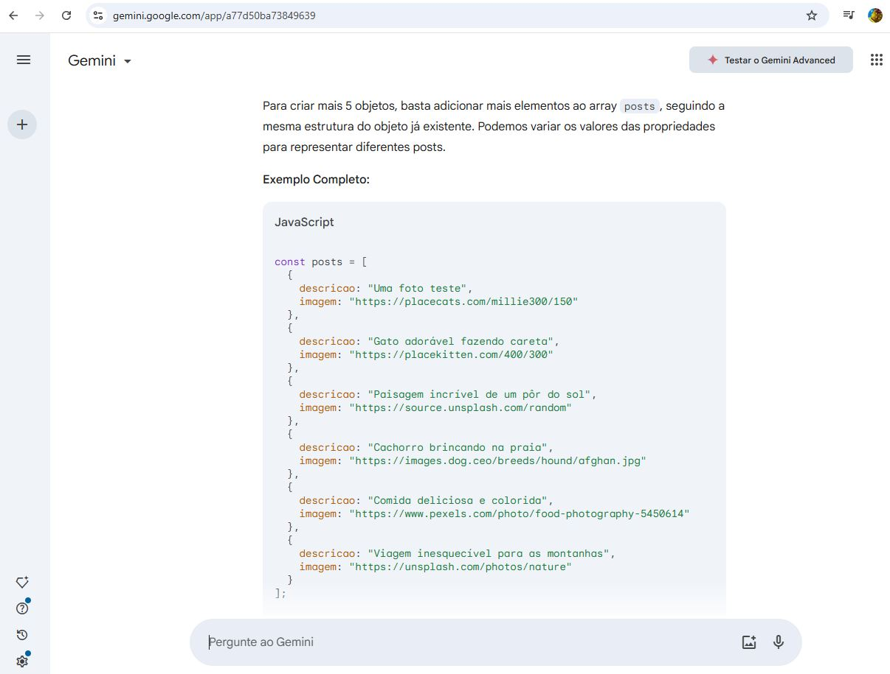</p>
<p>👆 &nbsp; <mark>Uso do Gemini IA da Google como consulta, apoio e criação.</mark></p>

</p>
<p>👆 &nbsp; <mark>Resposta do server id1 no Navegador.*</mark></p>

</p>
<p>👆 &nbsp; <mark>Resposta do server id2 no Navegador.</mark></p>

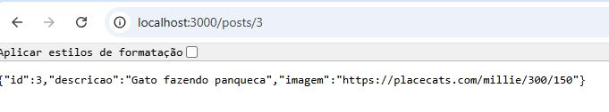</p>
<p>👆 &nbsp; <mark>Resposta do server id3 no Navegador.</mark></p>

</p>
<p>👆 &nbsp; <mark>Criação da conta do banco de dados MongoDB Atlas(nuvem).</mark></p>

**Relatório e documentaçao;**</p>
<p style="text-align: justify;">
[No arquivo server.js foi incrementado como uma base de dados uma variavel que recebe uma array de objetos; com id, descrição e imagens], [foi usado a IA Gemini do Google para consulta e criação de imagens e outros], [no código fonte server.js  alteramos info de Rota e incremntação de instancia de API no server], [criada e declarada uma function buscarPostID],[teste de nosso server, teste ok], [Criado conta para acesso ao banco MongoDB_Atlas hospedado na nuvem], [criado a pasta imagens e geradas algumas imagens do processo para arquivo e documentação posteriores], [criado arquivo mgDB.txt com informações sobre dados como username e password e path do banco de dados], [Por regras de boa prática o arquivo .gitignore foi alterado impedido que suba no gitHube via comandos no prompt git bash, arquivos como; node_modules, chave-api.txt e mgDB.txt], [Atualização do arquivo README.md - incrementação de imagens do processo, relatorios e documentação]. [criado repositorio iDevBackEnd no GitHube e salvo repositório em branch aula_2].</p> 

◙XXXXXXX


# 1ª AULA - DESVENDANDO APIS SERVIDORES 

**Relatório / Documentação;**</p>
<p style="text-align: justify;">
[Instalando Nodejs (LTS v.22.11.0) no Windows 10 64bits], [Instalando o Visual Studio Code no windows 10 64 bits], [Testando o Node.JS no terminal CMD do VSCode], [Criação da pasta do projeto "instaslike_back"], [ Instalando NPM e setando a linguagem JavaScript mais moderna ES6 juntamente e automaticamente criou a pasta de  package.json em nosso projeto], [Instalando as depencias como o express v"^4.21.1" via comandos de prompt via npm e junto e automatico a package-lock.json com 65 packages ou dependencias, instalado tbm a pasta node_modules dentro de nosso projeto], [criação do arquivo server.js como nosso servidor, nele  importamos o Express, incrementamos porta 3000 e funções de req request e res response e como respoosta send envia msg in http://localhost:3000/api e após executamos o server para testes e ok testes],[No site da Gemini google, gerando a nossa primeira chave api],[criação do arquivo chave-api.txt], [por boas práticas; criação do arquivo .gitignore para nos comandos do prompt do git bash não subir 2 condições; chave-api.txt e node_modules ], [Iserindo informações de relatório e documentação no arquivo README.md], [criado repositorio iDevBackEnd no GitHube e salvo repositório em branch aula_1]</p> 

◙XXXXXXX

# Autor
Fernando Cesar Seabra

www.linkedin.com/in/fernando-seabra